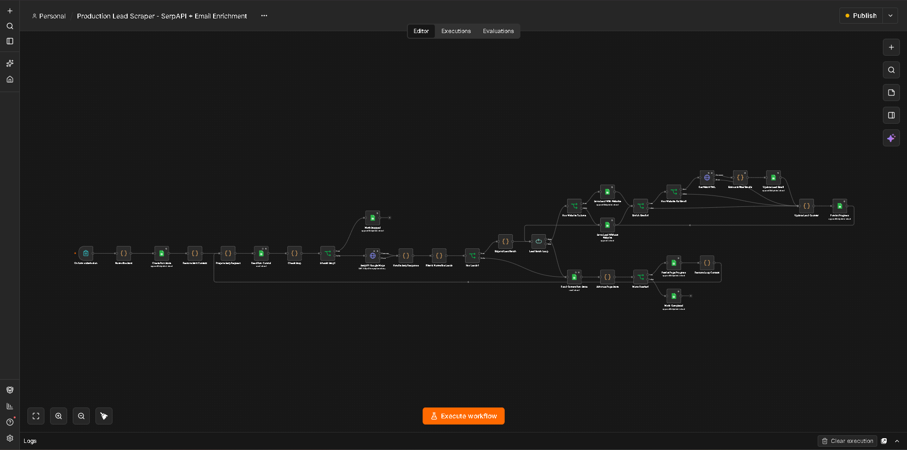
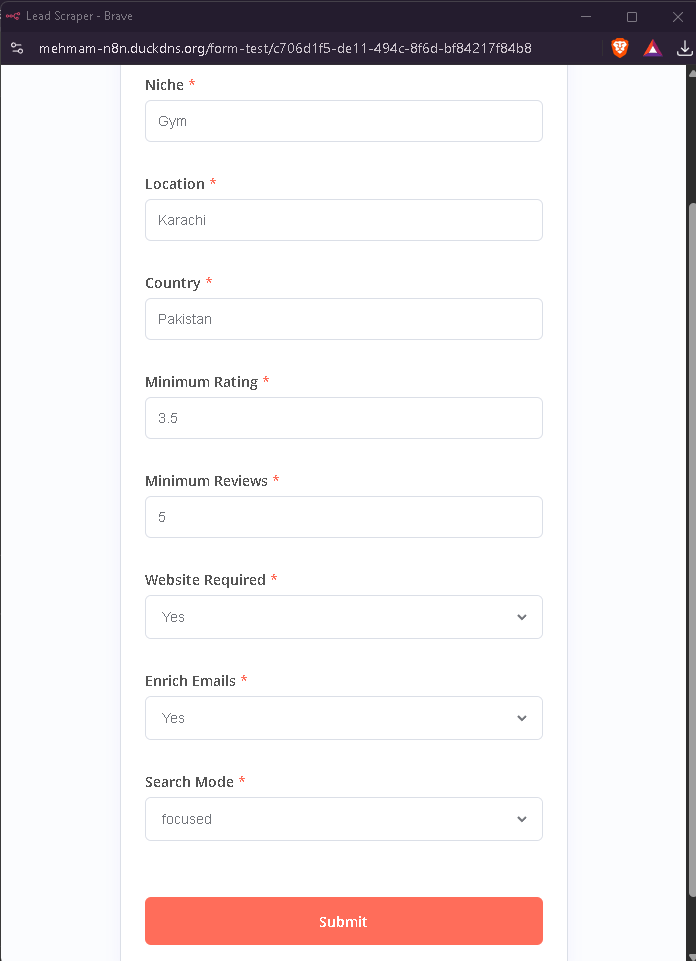
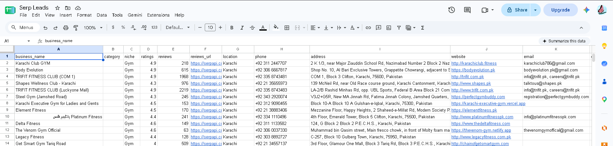
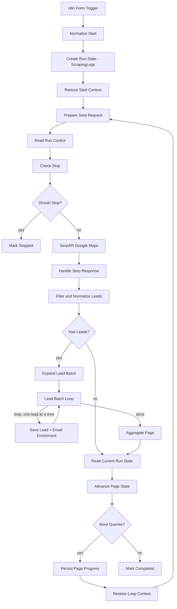

<div align="center">

# 🚀 Automated Lead Generation Pipeline

**Turn a niche and a city into a clean, deduplicated list of business leads with websites and contact emails, fully automated.**


</div>

<p align="center">▶️ <b><a href="https://lnkd.in/p/dpTKhuqb">Watch the demo on LinkedIn</a></b></p>



---

## Table of contents

1. [Overview](#overview)
2. [Key features](#key-features)
3. [Screenshots](#screenshots)
4. [Tech stack](#tech-stack)
5. [Architecture](#architecture)
6. [How a run works](#how-a-run-works)
7. [Node reference](#node-reference)
8. [Filtering rules](#filtering-rules)
9. [Email enrichment](#email-enrichment)
10. [State management and stop control](#state-management-and-stop-control)
11. [Google Sheet structure](#google-sheet-structure)
12. [Quick start](#quick-start)
13. [Detailed setup](#detailed-setup)
14. [Customization](#customization)
15. [Design decisions](#design-decisions)
16. [Limits and known constraints](#limits-and-known-constraints)
17. [Troubleshooting and lessons learned](#troubleshooting-and-lessons-learned)
18. [Roadmap](#roadmap)
19. [Responsible use](#responsible-use)
20. [Repository contents](#repository-contents)
21. [Author](#author)

---

## Overview

Building a lead list by hand means searching Google Maps, opening every website, copying details and maintaining a spreadsheet. This workflow automates the entire loop.

**You provide:**

```
Niche:    Dentists
Location: Karachi
Country:  Pakistan
```

**You get:** rows in Google Sheets with business name, website, phone, address, rating, review count and extracted contact emails, plus a full log of every run.

Works for any niche and any city, for example *Gyms in Karachi*, *Dentists in Dubai* or *Real Estate Agencies in New York*.

---

## Key features

| | Feature |
|---|---|
| 🔎 | **Discovery:** pulls businesses from Google Maps via SerpAPI, page after page |
| 🎯 | **Smart filtering:** rating, review count, real-website check, social-media-only pages removed |
| 📧 | **Email enrichment:** visits each website and extracts clean contact emails |
| 🧹 | **Deduplication:** leads are matched by website, so re-runs do not create duplicates |
| 📝 | **Observable runs:** every page logs how many results were found, kept and skipped, and why |
| ⏹️ | **Stop control:** a run can be stopped mid-scrape from the log sheet |
| 🔁 | **Resilient:** API errors and unreachable websites never crash a run |
| 🧩 | **Form-driven:** non-technical users can start a run from an n8n form |

---

## Screenshots

| Input form | Results in Google Sheets |
|---|---|
|  |  |

---

## Tech stack

| Tool | Role |
|---|---|
| **n8n** | Workflow automation: orchestration, logic and loops |
| **SerpAPI** (`google_maps` engine) | Google Maps results with pagination |
| **Google Sheets** | Lead storage and run state/log storage |
| **n8n Form Trigger** | Input form for niche, location and filters |
| **JavaScript (Code nodes)** | Filtering, normalization, email extraction, state handling |

---

## Architecture



The workflow has two nested loops:

- **Outer loop (pages):** one SerpAPI request per page (20 results), then the next page, then the next search variant.
- **Inner loop (leads):** every lead on the page is saved and enriched one at a time.

---

## How a run works

1. **Form submit.** The user enters niche, location, country, minimum rating, minimum reviews, website required (Yes/No), email enrichment (Yes/No) and search mode (focused/broad).
2. **Normalize Start.** Form labels are mapped to internal names and validated, and a unique `runId` is generated. The country becomes a SerpAPI `gl` code (Pakistan becomes `pk`). Search query variants are built:
   - *Focused:* `"<niche> in <location> <country>"` and `"<niche> <location> <country>"`
   - *Broad:* three phrasing variants
3. **Create Run State.** A row is written to the `ScrapingLogs` sheet with status `running`.
4. **Prepare Serp Request.** Selects the current query variant and page offset (`start`).
5. **Read Run Control and Check Stop.** Before every page the workflow re-reads its own log row. If `stop_requested` is `true` it exits through **Mark Stopped**.
6. **SerpAPI Google Maps.** Fetches one page of results.
7. **Handle Serp Response.** Extracts `local_results`. SerpAPI returns an error message when pagination runs out; this is treated as a normal end of the query, not a failure.
8. **Filter and Normalize Leads.** Applies the filtering rules, builds clean lead objects and counts *why* each result was skipped.
9. **Has Leads?** If nothing survived filtering, the page is skipped and pagination continues.
10. **Lead Batch Loop.** For each lead:
    - Save to the `Leads` sheet (with or without a website)
    - If enrichment is on and a website exists: fetch the HTML, extract emails, update the row
11. **Aggregate Page.** When the loop finishes, all processed leads are collapsed into one summary item (lead and email counts). This stops later nodes from running once per lead.
12. **Read Current Run State and Advance Page State.** Counters are updated and the next step is decided:
    - Page returned results: `start += 20`
    - No results or an error: move to the next query variant
13. **More Queries?** If variants remain, progress is persisted and the loop returns to step 4. Otherwise **Mark Completed**.

---

## Node reference

| Node | Type | Purpose |
|---|---|---|
| Form Trigger | n8n Form Trigger | Collects run inputs |
| Normalize Start | Code | Maps and validates inputs, builds `runId`, query variants and initial counters |
| Create Run State | Google Sheets (append or update) | Creates the run row in `ScrapingLogs` |
| Restore Start Context | Code | Restores the full run context after the Sheets node replaces `$json` |
| Prepare Serp Request | Code | Chooses the current query and offset |
| Read Run Control | Google Sheets (read) | Reads the run row to check for a stop request |
| Check Stop | Code | Sets `shouldStop` from `stop_requested` |
| Should Stop? | IF | Routes to stop or continue |
| SerpAPI Google Maps | HTTP Request | Calls `serpapi.com/search` with `engine=google_maps` |
| Handle Serp Response | Code | Extracts results and classifies API errors |
| Filter and Normalize Leads | Code | Filtering, URL normalization and skip-reason counters |
| Has Leads? | IF | Skips empty pages safely |
| Expand Lead Batch | Code | Turns the lead array into individual items |
| Lead Batch Loop | Split In Batches | Processes one lead at a time |
| Has Website To Save | IF | Chooses the save path |
| Save Lead With Website | Google Sheets (append or update) | Upsert keyed on `website` |
| Save Lead Without Website | Google Sheets (append) | Used when websites are not required |
| Enrich Emails? | IF | Honors the form setting |
| Has Website For Email | IF | Only fetches sites that exist |
| Get Web HTML | HTTP Request | Downloads the homepage (browser User-Agent, tolerant of bad SSL, errors never stop the run) |
| Extract and Filter Emails | Code | Finds and cleans email addresses |
| Update Lead Email | Google Sheets (append or update) | Writes emails and `is_enriched` |
| Update Lead Counter | Code | Emits the per-lead email count for aggregation |
| Aggregate Page | Code | Collapses the page's leads into one summary item |
| Read Current Run State | Google Sheets (read) | Reads the run row, filtered by `run_id` |
| Advance Page State | Code | Computes counters, next offset and next query |
| More Queries? | IF | Continue or finish |
| Persist Page Progress | Google Sheets (append or update) | Writes page-level progress and a readable status message |
| Restore Loop Context | Code | Restores context before the next page |
| Mark Completed / Mark Stopped | Google Sheets | Final status updates |

---

## Filtering rules

Applied in `Filter and Normalize Leads`:

| Rule | Behaviour |
|---|---|
| **Website required** | If enabled, businesses without a website are skipped |
| **Social-only pages** | Instagram, Facebook, TikTok, LinkedIn, X, YouTube, WhatsApp, Linktree and similar are skipped as "websites" |
| **Minimum rating** | Skipped if below the threshold |
| **Minimum reviews** | Skipped if below the threshold |
| **Niche relevance** | Used in *Broad* mode only. Matches niche stems against the business name, description and Google category. In *Focused* mode the Google Maps ranking is trusted |
| **Deduplication** | Within a page by `place_id` / website, across runs by `website` in the sheet |

Each page writes a readable summary to the log, for example:

```
Page 3: 20 found, 14 kept • skipped: no_website 4, reviews 2
```

URLs are normalized to the root domain (`https://example.com`) so the same business is not saved twice.

---

## Email enrichment

For each lead with a website the workflow downloads the homepage and extracts addresses from both `mailto:` links and plain text (including HTML-encoded `@`).

Emails are rejected when they:

- belong to placeholder domains (`example.com`, `domain.com`, ...)
- are generic non-contact addresses (`noreply`, `no-reply`, `webmaster`, `wordpress...`)
- look like file names (`logo@2x.png`)
- use obvious dummy local parts (`test`, `username`, `yourname`, ...)

Multiple emails per business are stored comma-separated. Only the homepage is crawled, so businesses that publish emails on a contact page will not always produce one.

---

## State management and stop control

All run state lives in the **`ScrapingLogs`** sheet, one row per run keyed by `run_id`:

- **Counters:** `leads_saved`, `pages_processed`, `api_errors`, `emails_found`, `skipped`
- **Position:** `query_index`, `start`
- **Control:** `status`, `stop_requested`, `message`
- **Timestamps:** `started_at`, `updated_at`, `completed_at`

**Stopping a run:** open `ScrapingLogs`, find the run row and set `stop_requested` to `true`. The workflow checks this before every page and exits cleanly with status `stopped`.

---

## Google Sheet structure

Create one spreadsheet with two tabs.

**Tab `ScrapingLogs`** (header row):

```
run_id | status | niche | location | country | min_rating | min_reviews | website_required | enrich_emails | query_index | start | leads_saved | pages_processed | api_errors | emails_found | skipped | stop_requested | message | started_at | completed_at | updated_at
```

**Tab `Leads`** (header row):

```
business_name | email | website | description | niche | ratings | reviews | reviews_url | location | phone | address | data_scrapped | is_enriched | email_sent | email_subject | email_body | sent_at
```

> Format the `phone` column as **Plain text** so numbers such as `+92...` are not converted.
> The columns `email_sent`, `email_subject`, `email_body` and `sent_at` are reserved for the upcoming outreach stage.

---

## Quick start

1. Create a Google Sheet with the two tabs and headers above.
2. Import `workflow.json` into n8n (*Workflows, Import from file*).
3. Add your **SerpAPI** and **Google Sheets OAuth2** credentials.
4. Point each Google Sheets node to your spreadsheet and the right tab.
5. Activate the workflow, open the Form Trigger's **Production URL**, fill the form and submit.

Results appear in the `Leads` tab while progress is logged in `ScrapingLogs`.

---

## Detailed setup

### Prerequisites

- An n8n instance (cloud or self-hosted)
- A [SerpAPI](https://serpapi.com/) account and API key
- A Google account with access to Google Sheets

### Steps

1. **Create the spreadsheet** with the two tabs and headers described above.
2. **Import the workflow:** n8n, then *Workflows, Import from file*, and select `workflow.json`.
3. **Add credentials** in n8n:
   - *SerpAPI* credential (your API key)
   - *Google Sheets OAuth2* credential
4. **Point every Google Sheets node** to your own spreadsheet and the correct tab (`ScrapingLogs` or `Leads`).
5. **Set the cell format** on the lead-saving nodes: *Options, Cell Format, Let Google Sheets format* (keeps phone numbers as text).
6. **Configure the Form Trigger** with these fields. The labels must match exactly, because `Normalize Start` reads them by name:

   | Label | Type |
   |---|---|
   | Niche | Text (required) |
   | Location | Text (required) |
   | Country | Text (default: Pakistan) |
   | Minimum Rating | Number (default 3.5) |
   | Minimum Reviews | Number (default 5) |
   | Website Required | Dropdown: Yes / No |
   | Enrich Emails | Dropdown: Yes / No |
   | Search Mode | Dropdown: focused / broad |

7. **Activate** the workflow and open the Form Trigger's **Production URL**.

### Using it

1. Open the form URL, enter a niche and a city, submit.
2. Watch progress in `ScrapingLogs` (the `message` column updates after every page).
3. Collect results from the `Leads` tab.
4. To abort a run, set `stop_requested = true` on its row.

**Tips**

- Start with *Website Required = No* and low thresholds to confirm the pipeline works, then tighten the filters.
- Use *Focused* mode for precise niches and *Broad* mode for wider coverage.
- Every SerpAPI page consumes API credits, so test with small runs first.

---

## Customization

| Goal | Where to change it |
|---|---|
| Different filters (rating, reviews) | Form fields, or defaults in `Normalize Start` |
| Block more social or marketplace domains | `blocked` list in `Filter and Normalize Leads` |
| Support more countries | `glMap` in `Normalize Start` (country name to SerpAPI `gl` code) |
| More search phrasings | `variants` array in `Normalize Start` |
| Stricter or looser email rules | Lists at the top of `Extract and Filter Emails` |
| Limit pagination depth | The `start>=400` check in `Advance Page State` |

---

## Design decisions

| Decision | Reason |
|---|---|
| **Google Sheets as the state store** | Simple, visible to the user, and allows stopping a run by editing one cell |
| **Re-reading the run row before every page** | Gives a safe, clean stop point without killing the execution |
| **Restore Context Code nodes** | Sheets nodes replace `$json` with the written row, so the full run context is restored explicitly |
| **Aggregate Page node** | The loop's "done" output emits every item; aggregating avoids running downstream nodes once per lead and keeps API reads low |
| **Skip-reason logging** | A filter that silently drops everything is the hardest bug to find; logging why makes it obvious |
| **Errors never stop the run** | Unreachable sites and API hiccups are expected in scraping; the lead is kept and the run continues |

---

## Limits and known constraints

| Constraint | Detail |
|---|---|
| **Google Sheets read quota** | About 60 reads per minute per user. `append or update` nodes read the sheet internally. The workflow limits reads (no per-lead progress writes, one aggregated read per page) but very fast runs can still hit the quota. Add a short Wait node in the lead loop if needed |
| **SerpAPI credits** | One credit per page request |
| **Result depth** | Google Maps pagination typically ends after several pages per query |
| **Email coverage** | Homepage only, and many businesses do not publish an email |
| **Sites that block bots** | Some sites return errors; the lead is saved without an email |
| **Progress view** | Progress is tracked in the sheet, not in a custom web UI |

---

## Troubleshooting and lessons learned

| Symptom | Cause | Fix |
|---|---|---|
| **0 leads, no error** | A URL-parsing step failed silently, so every business looked like it had no website and was filtered out | Replaced `new URL(...)` handling with a regex-based normalizer and added per-page skip-reason logging |
| **Flow stops after the first page** | A node after a Sheets node read fields that only exist in the original context | Added "Restore Context" Code nodes after Sheets nodes that replace `$json` |
| **Stop control never worked** | Progress writes kept resetting `stop_requested` to `false` | Progress nodes no longer write `status` or `stop_requested` |
| **`Quota exceeded for Read requests`** | Each `append or update` performs a read; per-lead writes plus a loop output that triggered the next node once per lead exceeded 60 reads/min | Removed per-lead progress writes and added the `Aggregate Page` node |
| **Phone numbers corrupted** | Sheets interpreted `+92...` as a number or formula | Plain-text column plus a leading apostrophe with *Let Google Sheets format* |
| **Fake emails like `logo@2x.png`** | The regex matched image file names | Added a file-extension filter |
| **`Unexpected token 'const'`** | Code pasted together with leftover lines or Markdown fences | Replace the whole code box and paste only the code |

> **Main lesson:** a pipeline that fails silently is worse than one that crashes loudly. Log *what came in, what was kept, what was dropped, and why*.

---

## Roadmap

- [ ] AI-personalised outreach emails per lead (LLM node writing `email_subject` and `email_body`)
- [ ] Lead scoring from website content
- [ ] Contact-page crawling for better email coverage
- [ ] Automated, rate-limited email sending with `email_sent` / `sent_at` tracking
- [ ] Multi-city batch runs from a list

---

## Responsible use

- Respect each website's terms of service and `robots.txt`.
- Follow applicable regulations for cold outreach (for example CAN-SPAM, GDPR and local anti-spam laws): identify yourself, offer an opt-out and honor it.
- Use the data for legitimate business purposes only.

---

## Repository contents

```
.
├── README.md
├── workflow.json                                  # exported n8n workflow (IDs sanitized)
├── Lead_Generation_Pipeline_Documentation.pdf     # printable version of this documentation
├── LICENSE
└── screenshots/
    ├── workflow-overview.png
    ├── form.png
    └── results-sheet.png
```

---

## Author

**Syed Muhammad Mehmam**, AI Engineer

Feedback and ideas are welcome. Open an issue or reach out on LinkedIn.

<!-- Add your links here, for example:
[LinkedIn](https://www.linkedin.com/in/your-profile) · [GitHub](https://github.com/your-username)
-->
